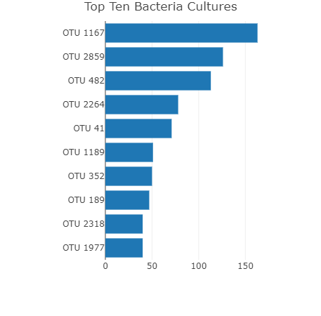
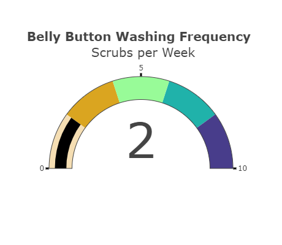
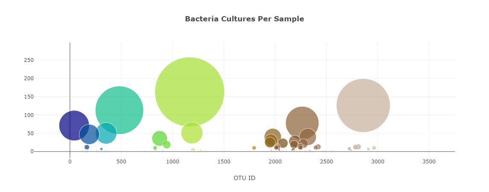
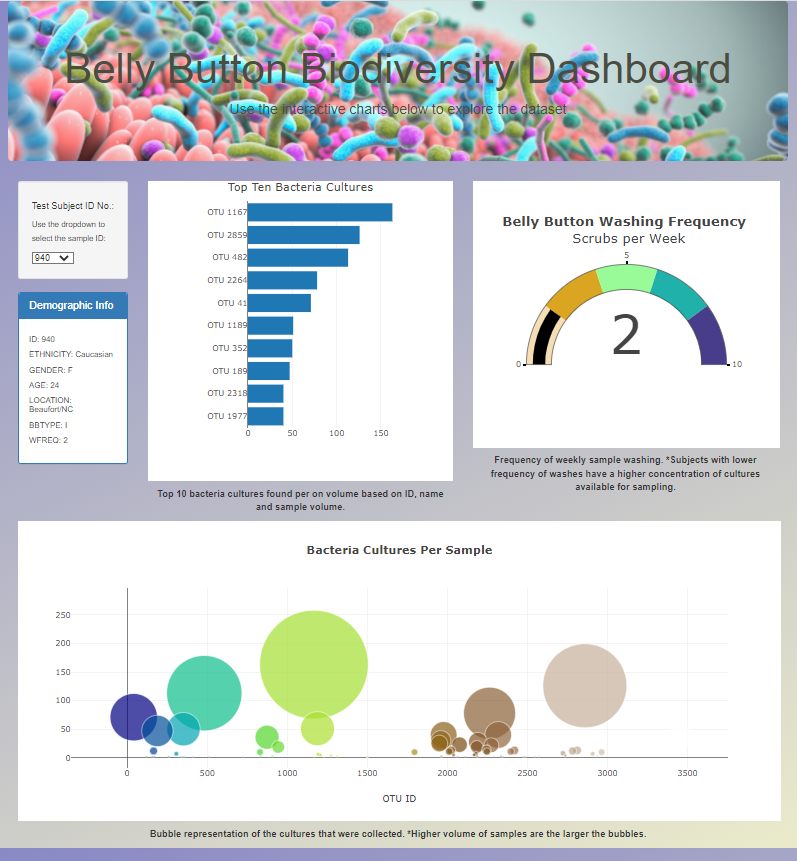

# Belly_Button_Microbiome_Challenge
Visual analysis of the microbiome diversity in a human's belly button

# Purpose
The purpose of this challenge was to build a webpage using Plotly.js, a Javascript visualization library, to plot data and then publish to a webpage. The data was wrangled into three different visualizations including a bar, gauge, and bubble chart. Other dynamic functions of this webpage include programming to create drop-down menus and interactive chart components that allow the bacteria culture data to be easily digestible. The stylized data represents various the cultures that live within the microbiome of a human belly button. 

# Results
In the search for the microorganisms that could possibly be replicated for food profiling, the data must be collected and synthesized in an easy-to-read dashboard. The dashboard will consist of the a drop down menu with all data samples of known bacteria that have colonized in the human belly button. After which, the various charts will updated to reflect the attributes of that data. 

The first chart created included a horizontal bar chart to display the top 10 bacterial species (OTUs) when an individual’s ID is selected from the dropdown menu on the webpage. The horizontal bar chart will display the `sample_values` as the values, the `otu_ids` as the labels, and the `otu_labels` as the hover text for the bars on the chart. The bar chart for sample ID 940 appears as below:

The second plot to be created is a gauge chart that displays the weekly washing frequency's value, and display the value as a measure from 0-10 on the progress bar in the gauge chart when an individual ID is selected from the dropdown menu. The gauge chart for sample ID 940 appears as below:

The third chart to be updated is a bubble chart that will display the following when an individual’s ID is selected from the dropdown menu webpage:

- The `otu_ids` as the x-axis values.
- The `sample_values` as the y-axis values.
- The `sample_values` as the marker size.
- The `otu_ids` as the marker colors.
- The `otu_labels` as the hover-text values.

The bubble chart for sample ID 940 appears as below:

After all is updated, the final rendering of the website was tweaked to add some style. There was color variation in the body, text was added below the images, and an image was added to the jumbotron. Future renditions of the website should be made so that it becomes mobile responsive.

